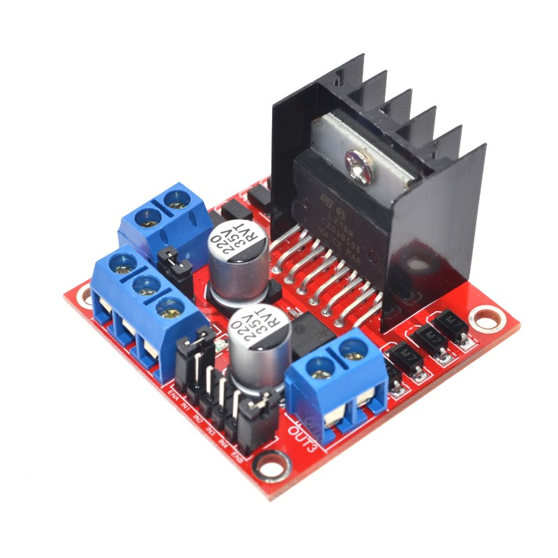
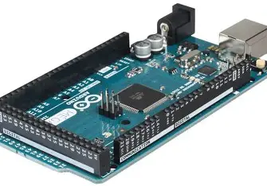
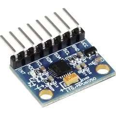
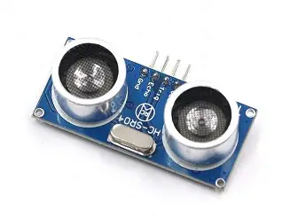
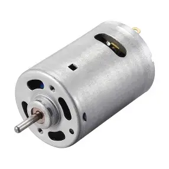
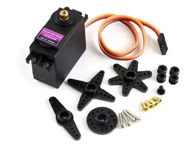
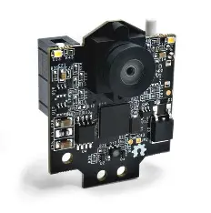

This repository contains **documentation, source code, team photos, vehicle photos, and 3D models**, all related to the complete engineering process for the **WRO Future Engineers 2025** competition.

## Table of Contents  

- [Future Engineers – WRO 2025](#future-engineers--wro-2025)
- [Components](#components)
  - [L298M Motor Driver x1](#l298m-motor-driver-x1)
  - [Arduino Omega x1](#arduino-omega-x1)
  - [MPU-6050 x1](#mpu-6050-x1)
  - [Ultrasonic sensors HC-SR04 x3](#ultrasonic-sensors-hc-sr04-x3)
  - [DC Motor (generic) x1](#dc-motor-generic-x1)
  - [Servo Motor MG996R x1](#servo-motor-mg996r-x1)
  - [Pixy 2.1 Camera](#pixy-21-camera)
  - [9V Rechargeable Batteries x2](#9v-rechargeable-batteries-x2)
- [CODE](#code)
  - [Sensors Module](#sensors-module)
  - [Motor Control Module](#motor-control-module)
  - [Pixy Module](#pixy-module)


# Future Engineers – WRO 2025

The Future Engineers category of the WRO 2025 focuses on developing real-world engineering skills through hands-on robotics challenges. This competition encourages creativity, problem-solving, and teamwork while giving participants the opportunity to design, build, and program advanced robotic systems.

Each year, the challenge changes, requiring teams not only to solve the current problem but also to adapt quickly to new scenarios and requirements. This helps participants learn how to think like engineers: iterating on their designs, testing solutions, and improving their approach as they go.

As part of the competition, teams are required to document their entire project process in a GitHub repository. This includes sharing their design decisions, code, and testing results, as well as reflecting on what worked, what didn’t, and how their solution evolved over time. The documentation is an important part of the evaluation, as it demonstrates each team’s ability to communicate their engineering process clearly and professionally.

# Components 

The project uses an Arduino Omega as the central controller, connected to an MPU6050 for motion sensing, three HC-SR04 ultrasonic sensors for obstacle detection, DC motors driven by an L298 module for movement, and a MG996R servo for steering. A Pixy 2.1 camera provides vision-based target tracking, while two 9V rechargeable batteries supply power to the system.

## L298M Motor Driver x1

Specifications:
---
**Electrical Specs:**
- Logic voltage (Vss): 4.5 V – 7 V 
- Motor supply voltage (Vs): 5 V – 46 V V depending on version
- Output current: up to 2 A continuous, peak about 3 A 
- Total power dissipation: ~25 W 
**Performance:**
- Number of channels: 2 (can drive 2 DC motors or 1 stepper motor)
- Output type: Dual full H-bridge
- Control inputs: TTL-compatible (high = 2.3 V+, low = 1.5 V max)
- Enable pins: Allow PWM speed control
- Diodes: Built-in protection diodes for inductive loads (in most module versions)
---
## Arduino omega x1

- Microcontroller: ATmega328P
- Operating voltage: 5 V
- Recommended input voltage: 7 – 12 V (limit 6 – 20 V)
- Digital I/O pins: 14 (6 PWM)
- Analog input pins: 6
- DC current per I/O pin: 40 mA max
- Flash memory: 32 KB
- SRAM: 2 KB
- EEPROM: 1 KB
- Clock speed: 16 MHz
---
## MPU-6050 x1

- Operating voltage: 3.3 – 5 V
- Communication: I²C (SCL, SDA)
- Accelerometer range: ±2g, ±4g, ±8g, ±16g
- Gyroscope range: ±250, ±500, ±1000, ±2000 °/s
- Extras: Motion detection, built-in temperature sensor
---
## Ultrasonic sensors HC-SR04 x3

- Operating voltage: 5 V DC
- Current draw: ~15 mA
- Measuring angle: ~15°
- Min. distance: 2 cm
- Max. distance: 4 m
- Accuracy: ±3 mm
- Pins: VCC, GND, Trig, Echo
---
## DC Motor (generic) x1

**(values depend on model – comon ranges)**
- Rated voltage: 6 – 12 V
- No-load current: 100 – 300 mA
- Load current: 0.6 – 1 A (peak up to 2 A)
- Speed: 3000 – 10000 rpm @ 12 V
---
## Servo Motor MG996R x1

- Operating voltage: 4.8 – 7.2 V
- Stall torque:
- 9.4 kg·cm @ 4.8 V
- 11 kg·cm @ 6 V
- Speed: 0.19 s/60° @ 6 V
- Rotation angle: 120° (typical), some units up to 180°
- Max current: 500 – 900 mA (stall peak up to 2.5 A)
- Weight: ~55 g
---
## Pixy 2.1 Camera

- Operating voltage: 5 V (typical consumption ~140 mA)
- Image sensor: Omnivision OV9715 (1296 × 976 px)
- Frame rate: 60 fps
- Interfaces: UART, SPI, I²C, USB
- Functions: Object recognition by color/shape, line tracking, color-code reading, servo output support
---
## 9V Rechargeable Batteries x2

- Nominal voltage: 9 V each
- Configuration:
- Series: 18 V total
- Parallel: 9 V with double capacity
- Typical capacity: 200 – 600 mAh (NiMH or Li-ion type)
- Use case: Suitable for low-current loads; not ideal for high-drain motors
---

# CODE

The code integrates three main types of sensors and multiple actuators to create an autonomous robot that can sense obstacles with ultrasonic sensors, steer with a servo, drive forward using a DC motor driver, and detect and follow visual targets using a Pixy2 camera. A push button toggles the robot between active and inactive states. The code is organized in functional blocks (modules) that handle sensing, actuation, decision-making and user control.

Below each module is expanded with implementation details, rationale, pitfalls, and practical tips for tuning and testing.

## LiDAR Sensors module
### Functions & pins

`````
#include "Adafruit_VL53L1X.h"
typedef Adafruit_VL53L1X liDar;

const int leftShut = 11;
const int frontShut = 13;
const int rightShut = 12;

liDar leftSensor = liDar(leftShut);
liDar frontSensor = liDar(frontShut);
liDar rightSensor = liDar(rightShut);

long leftDist;
long frontDist;
long rightDist;

int readDistance(Adafruit_VL53L1X &vl53) {
  if (vl53.dataReady()) {
    int distance = vl53.distance();
    vl53.clearInterrupt();
    return distance;
  }
  return -1;
}

void printDistances(long L, long F, long R) {
  Serial.print("Left: ");  Serial.print(L);  Serial.print(" cm     |     ");
  Serial.print("Front: "); Serial.print(F);  Serial.print(" cm     |     ");
  Serial.print("Right: "); Serial.println(R);
}
`````

### Its function

Each LiDAR sensor (VL53L1X) measures the distance to the nearest obstacle using time-of-flight laser pulses instead of ultrasound.
readDistance(vl53) checks if new data is available using dataReady(), retrieves the distance via distance(), and returns it in millimeters.
If no valid reading is available, it returns -1.
printDistances() displays the current distance readings of all three sensors (left, front, and right) in the Serial Monitor for debugging and calibration.

## Motor Control module
### Functions & pins

`````
const int IN3 = 32;
const int IN4 = 34;
const int ENB = 2;

void motor(int in3, int in4, int speed) {
  digitalWrite(IN3, in3);
  digitalWrite(IN4, in4);
  analogWrite(ENB, speed);
}
`````

### Its function

The motor control module drives a DC motor using two digital direction pins (IN3, IN4) and one PWM-enabled speed pin (ENB).
motor(in3, in4, speed) defines direction and speed based on logic levels:

IN3 = HIGH, IN4 = LOW → forward rotation.

IN3 = LOW, IN4 = HIGH → reverse rotation.
The speed is controlled by analogWrite(ENB, speed) (0–255 PWM).

### Functions & pins

`````
const int IN1 = 28;   
const int IN2 = 30;   
const int ENA = 3;

void motorEncendido(int speed) {
  digitalWrite(IN1, HIGH);
  digitalWrite(IN2, LOW);  
  analogWrite(ENA, speed); 
}
`````

### Its function

motorEncendido(int speed) sets the direction pins and uses analogWrite(ENA, speed) to control motor speed via PWM.

In the code digitalWrite(IN1, HIGH); digitalWrite(IN2, LOW); is used for forward direction only.

### Points to take in consider

**Power supply:** Motor motors can draw large currents and cause voltage dips.

## Pixy module

### Functions & pins

`````
#define SIG_ROJO 1
#define SIG_VERDE 2

const int IMG_W = 320;
const int IMG_CENTER_X = IMG_W / 2;   // 160 pixeles
const int LEFT_TARGET_X  = 110;      // posición objetivo del centro del bloque cuando queremos que esté a la izquierda (ajustar en pruebas)
const int RIGHT_TARGET_X = 210;      // posición objetivo cuando queremos que el bloque esté a la derecha
const int DEADZONE_X = 12;           // tolerancia en píxeles (±). Ajustar: 6-20 según estabilidad
const int MAX_TURN_ERROR = 160;      // rango máximo de error en px para mapear a ángulo (puede quedar 160)

// --- Función principal de seguimiento con referencia X según color ---
void seguirConReferenciaX() {
  // Pedimos bloques de la Pixy
  pixy.ccc.getBlocks();
  if (pixy.ccc.numBlocks <= 0) {
    // No detecta nada: recto
    miServo.write(servoCenter);
    motorEncendido(velocidad);
    Serial.println("No block detected -> recto");
    return;
  }

  // Elegir el bloque más grande (por área)
  int best = 0;
  long bestArea = 0;
  for (int i = 0; i < pixy.ccc.numBlocks; i++) {
    long area = (long)pixy.ccc.blocks[i].m_width * (long)pixy.ccc.blocks[i].m_height;
    if (area > bestArea) {
      bestArea = area;
      best = i;
    }
  }

  int sig = pixy.ccc.blocks[best].m_signature;       // firma de color
  float bx = pixy.ccc.blocks[best].m_x;
  float bw = pixy.ccc.blocks[best].m_width;
  float cx = bx + bw/2.0;                            // centro X del bloque (0..319)

  // determinar desiredX según el color:
  float desiredX = IMG_CENTER_X; // fallback (centro)
  if (sig == SIG_ROJO) {
    // ROJO -> señal a la izquierda -> robot debe pasar por la derecha -> objetivo: bloque a la izquierda
    desiredX = LEFT_TARGET_X;
    Serial.print("ROJO -> targetX=");
  } else if (sig == SIG_VERDE) {
    // VERDE -> señal a la derecha -> robot pasa por la izquierda -> objetivo: bloque a la derecha
    desiredX = RIGHT_TARGET_X;
    Serial.print("VERDE -> targetX=");
  } else {
    Serial.print("SIGNATURE ");
    Serial.print(sig);
    Serial.print(" -> usar centro como targetX=");
  }
  Serial.print(desiredX);
  Serial.print(" | cx=");
  Serial.println(cx);

  // error = cuánto hay que desplazar el centro del bloque hasta la referencia deseada
  // positive -> cx está a la derecha del desiredX (hay que girar derecha)
  // negative -> cx está a la izquierda del desiredX (hay que girar izquierda)
  float error = cx - desiredX;

  // zona muerta: si el error está dentro del rango, se considera "cumplido" y vamos rectos
  if (abs(error) <= DEADZONE_X) {
    // dentro de deadzone: recto y mantener velocidad
    miServo.write(servoCenter);
    motorEncendido(velocidad);
    Serial.println("Dentro de deadzone -> recto y mantener");
    return;
  }

  // fuera de deadzone -> corregir proporcionalmente
  // mapeamos el error (-MAX_TURN_ERROR..+MAX_TURN_ERROR) a (servoLeft..servoRight)
  // Nota: usamos map con enteros, convertimos error a int
  int errInt = (int) constrain(error, -MAX_TURN_ERROR, MAX_TURN_ERROR);
  int servoAngle = map(errInt, -MAX_TURN_ERROR, MAX_TURN_ERROR, servoLeft, servoRight);
  servoAngle = constrain(servoAngle, min(servoLeft, servoRight), max(servoLeft, servoRight));

  miServo.write(servoAngle);
  motorEncendido(velocidad);

  // Debug
  Serial.print("Error(px)="); Serial.print(error);
  Serial.print(" -> Servo="); Serial.println(servoAngle);
}
`````

### Its function

The **seguirConReferenciaX()** function enables the robot to follow colored blocks detected by the Pixy2 camera. It selects the largest block (the closest), identifies its color (red or green), and adjusts the robot’s steering to keep the block at a target position in the camera’s image. If the block is already at the target position, the robot moves straight; otherwise, it turns proportionally to correct its path. This allows the robot to navigate and avoid obstacles by following color cues.

### Points to take in consider


**Lighting conditions:** The Pixy2 camera’s color detection can be affected by changes in ambient light. Consistent lighting improves reliability.
**Deadzone tuning:** Adjust the **DEADZONE_X** value for stability. Too small may cause constant steering corrections; too large may reduce accuracy.
**Camera alignment:** The Pixy2 should be mounted so its field of view matches the robot’s forward direction for correct block positioning.

