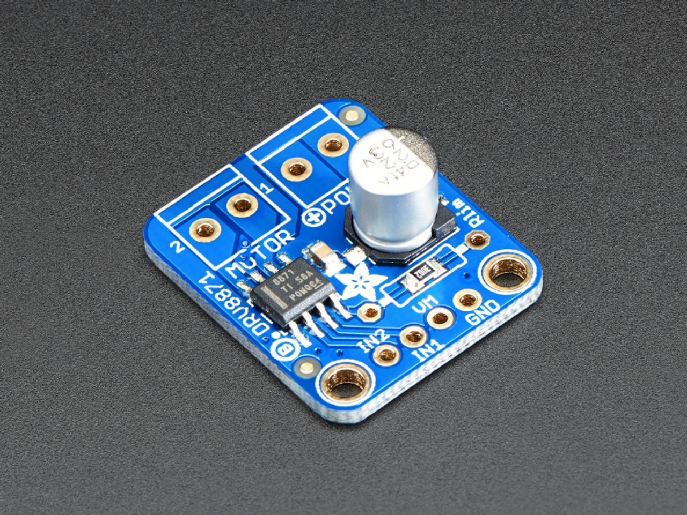
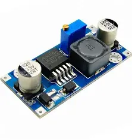
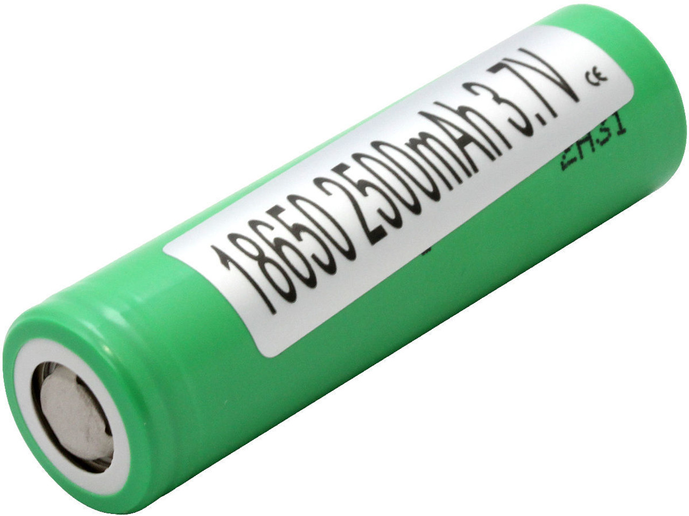

This repository contains **documentation, source code, team photos, vehicle photos, and 3D models**, all related to the complete engineering process for the **WRO Future Engineers 2025** competition.

## Table of Contents  

- [Future Engineers – WRO 2025](#future-engineers--wro-2025)
- [Components](#components)
  - [L298M Motor Driver x1](#l298m-motor-driver-x1)
  - [Arduino Omega x1](#arduino-omega-x1)
  - [MPU-6050 x1](#mpu-6050-x1)
  - [Ultrasonic Sensors HC-SR04 x3](#ultrasonic-sensors-hc-sr04-x3)
  - [DC Motor (generic) x1](#dc-motor-generic-x1)
  - [Servo Motor MG996R x1](#servo-motor-mg996r-x1)
  - [Pixy 2.1 Camera](#pixy-21-camera)
  - [9V Rechargeable Batteries x2](#9v-rechargeable-batteries-x2)
- [CODE](#code)
  - [Ultrasonic Sensors Module](#ultrasonic-sensors-module)
  - [Motor Control Module](#motor-control-module)
  - [Servo Steering Module](#servo-steering-module)
  - [IMU (Gyroscope) Module](#imu-gyroscope-module)
  - [Button Control Module](#button-control-module)
  - [PID Control Module](#pid-control-module)
  - [Overall Logic (Main Loop)](#overall-logic-main-loop)


# Future Engineers – WRO 2025

The Future Engineers category of the WRO 2025 focuses on developing real-world engineering skills through hands-on robotics challenges. This competition encourages creativity, problem-solving, and teamwork while giving participants the opportunity to design, build, and program advanced robotic systems.

Each year, the challenge changes, requiring teams not only to solve the current problem but also to adapt quickly to new scenarios and requirements. This helps participants learn how to think like engineers: iterating on their designs, testing solutions, and improving their approach as they go.

As part of the competition, teams are required to document their entire project process in a GitHub repository. This includes sharing their design decisions, code, and testing results, as well as reflecting on what worked, what didn’t, and how their solution evolved over time. The documentation is an important part of the evaluation, as it demonstrates each team’s ability to communicate their engineering process clearly and professionally.

# Components 

The project uses an Arduino Omega as the central controller, connected to an MPU6050 for motion sensing, three HC-SR04 ultrasonic sensors for obstacle detection, DC motors driven by an L298 module for movement, and a MG996R servo for steering. A Pixy 2.1 camera provides vision-based target tracking, while two 9V rechargeable batteries supply power to the system.

---
## Adafruit DRV8871 DC Motor Driver x1

**Electrical Specs:**
- 6.5V to 45V motor power voltage
- Up to 5.5V logic level on IN pins
- 565mΩ Typical RDS(on) (high + low)
- 3.6A peak current
- PWM control
- Current limiting/regulation without an inline sense resistor
- Undervoltage lockout
- Overcurrent protection
- Thermal shutdown
---
## LM2596 DC-DC Buck Converter x1


**Electrical Specs:**
- Input voltage range: 4.5V to 40V
- Output voltage range: 1.5V to 35V
- Load current: 3A - absolute rating.
- Dimensions: 21mm x 44mm x 14mm
---
## Arduino Mega x1


**Electrical Specs:**
- Microcontroller: ATmega328P
- Operating voltage: 5 V
- Recommended input voltage: 7 – 12 V (limit 6 – 20 V)
- Digital I/O pins: 14 (6 PWM)
- Analog input pins: 6
- DC current per I/O pin: 40 mA max
- Flash memory: 32 KB
- SRAM: 2 KB
- EEPROM: 1 KB
- Clock speed: 16 MHz
---
## MPU-6050 x1


**Electrical Specs:**
- Operating voltage: 3.3 – 5 V
- Communication: I²C (SCL, SDA)
- Accelerometer range: ±2g, ±4g, ±8g, ±16g
- Gyroscope range: ±250, ±500, ±1000, ±2000 °/s
- Extras: Motion detection, built-in temperature sensor
---
## Ultrasonic sensors HC-SR04 x3


**Electrical Specs:**
- Operating voltage: 5 V DC
- Current draw: ~15 mA
- Measuring angle: ~15°
- Min. distance: 2 cm
- Max. distance: 4 m
- Accuracy: ±3 mm
- Pins: VCC, GND, Trig, Echo
---
## DC Motor (generic) x1


**Electrical Specs:**
**(values depend on model – comon ranges)**
- Rated voltage: 6 – 12 V
- No-load current: 100 – 300 mA
- Load current: 0.6 – 1 A (peak up to 2 A)
- Speed: 3000 – 10000 rpm @ 12 V
---
## Servo Motor MG996R x1


**Electrical Specs:**
- Operating voltage: 4.8 – 7.2 V
- Stall torque:
- 9.4 kg·cm @ 4.8 V
- 11 kg·cm @ 6 V
- Speed: 0.19 s/60° @ 6 V
- Rotation angle: 120° (typical), some units up to 180°
- Max current: 500 – 900 mA (stall peak up to 2.5 A)
- Weight: ~55 g
---
## Pixy 2.1 Camera


**Electrical Specs:**
- Operating voltage: 5 V (typical consumption ~140 mA)
- Image sensor: Omnivision OV9715 (1296 × 976 px)
- Frame rate: 60 fps
- Interfaces: UART, SPI, I²C, USB
- Functions: Object recognition by color/shape, line tracking, color-code reading, servo output support
---
## Samsung Li-Ion Battery x4

**Electrical Specs:**
- Capacity: 2500 mAh
- Unprotected INR Cell
- Chemistry: LiNiMnCoO2 (Lithium Iron Phosphate With Nickel/Manganese Oxide Cathode)
- Dimensions:
  - Diameter: 18.33 + / - 0.07mm
  - Height: 64.85 + / - 0.15mm
- Weight: 45.0g
- Nominal Voltage: Average 3.7V
- Maximum Continuous Discharge: 20A (At 25 Degrees Celsius)
- Cut-off Voltage: 2.5V
- Internal Impedance: ≤ m18Ω
- Cycle life: > 250 cycles
- Charge: 1.25A, 4.20V,CCCV 125mA cut-off
- Discharge: 0.2C, 2.5V discharge cut-off
---

# CODE

The code integrates three main types of sensors and multiple actuators to create an autonomous robot that can sense obstacles with ultrasonic sensors, steer with a servo, drive forward using a DC motor driver, and detect and follow visual targets using a Pixy2 camera. A push button toggles the robot between active and inactive states. The code is organized in functional blocks (modules) that handle sensing, actuation, decision-making and user control.

Below each module is expanded with implementation details, rationale, pitfalls, and practical tips for tuning and testing.

## Ultrasonic Sensors Module
### Functions & pins

`````
// ------------------------Sensores ultrasónicos -------------------------
const int triggerPinRight = 8;    
const int echoPinRight = 9;

const int triggerPinFront = 11;   
const int echoPinFront = 10;

const int triggerPinLeft = ;    
const int echoPinLeft = 12;

long leftDist, frontDist, rightDist;

long readDistance(int trigPin, int echoPin) {
  digitalWrite(trigPin, LOW);
  delayMicroseconds(2);
  digitalWrite(trigPin, HIGH);
  delayMicroseconds(10);
  digitalWrite(trigPin, LOW); 

  float time = pulseIn(echoPin, HIGH, 30000);  // Timeout de 30ms
  float distance = (time / 2.0) / 29.1;        // Conversión a cm

  Serial.print(distance); Serial.println(" cm");
  return distance;
}

void printDistances(long L, long F, long R) {
  Serial.print("Left: ");  Serial.print(L); Serial.print(" cm     |     ");
  Serial.print("Front: "); Serial.print(F); Serial.print(" cm     |     ");
  Serial.print("Right: "); Serial.print(R); Serial.println(" cm");
}
`````

### Its function

Each ultrasonic sensor measures the distance to the nearest obstacle using ultrasound.
If no valid reading is available, it returns -1.
printDistances() displays the current distance readings of all three sensors (left, front, and right) (that its latter converted to cm using float distance = (time / 2.0) / 29.1.) in the Serial Monitor for debugging and calibration.

## Motor Control module
### Functions & pins

`````
const int IN3 = 32;
const int IN4 = 34;
const int ENB = 2;

void motor(int in3, int in4, int speed) {
  digitalWrite(IN3, in3);
  digitalWrite(IN4, in4);
  analogWrite(ENB, speed);
}
`````

### Its function

The motor control module drives a DC motor using two digital direction pins (IN3, IN4) and one PWM-enabled speed pin (ENB).
motor(in3, in4, speed) defines direction and speed based on logic levels:

IN3 = HIGH, IN4 = LOW → forward rotation.

IN3 = LOW, IN4 = HIGH → reverse rotation.
The speed is controlled by analogWrite(ENB, speed) (0–255 PWM).

## Servo Steering module
### Functions & pins

`````
#include <Servo.h>
Servo servo;

const int pinServo = 19;
const int servoCenter = 85;
const int servoLeft = 45;
const int servoRight = 110;

int ultimoAngulo = -1;
unsigned long lastServoWrite = 0;
const unsigned long servoWriteInterval = 80;  // ms

void setServo(int ang) {
  ang = constrain(ang, servoLeft, servoRight);
  unsigned long now = millis();
  if (ang != ultimoAngulo && (now - lastServoWrite) >= servoWriteInterval) {
    servo.write(ang);
    ultimoAngulo = ang;
    lastServoWrite = now;
  }
}
`````

### Its function

The servo module is responsible for steering control.
setServo(ang) adjusts the servo position while ensuring smooth motion and avoiding excessive signal updates by adding a time interval (servoWriteInterval).
The constrain() function limits the rotation range to safe mechanical angles.

## IMU (Gyroscope) module
### Functions & pins

`````
#include <Wire.h>
#include "MPU6050.h"
MPU6050 mpu;

float angle = 0.0;
float gyroZOffset = 0.0;
unsigned long tPrevMicros;
const float GYRO_SENS = 131.0;
float initialAngle = 0;
float angleDiff = 0;

void updateAngle() {
  int16_t ax, ay, az, gx, gy, gz;
  mpu.getMotion6(&ax, &ay, &az, &gx, &gy, &gz);

  unsigned long tNow = micros();
  float dt = (tNow - tPrevMicros) / 1000000.0f;
  tPrevMicros = tNow;

  float velZ = (float)gz / GYRO_SENS - gyroZOffset;
  angle = fmod(angle + velZ * dt + 360.0f, 360.0f);
}

void calibrarGiroZ(int samples) {
  double sum = 0.0;
  for (int i = 0; i < samples; i++) {
    int16_t ax, ay, az, gx, gy, gz;
    mpu.getMotion6(&ax, &ay, &az, &gx, &gy, &gz);
    sum += (double)gz / GYRO_SENS;
    delay(2);
  }
  gyroZOffset = sum / samples;
  Serial.println("Gyro Z calibration completed");
}
`````

### Its function

The IMU module (MPU6050) continuously measures the robot’s angular velocity around the Z-axis to maintain orientation during motion and turns.
updateAngle() integrates the gyroscope’s Z-axis readings to estimate current yaw (rotation).
calibrarGiroZ(samples) averages multiple samples to calculate the gyro’s bias offset, improving accuracy and reducing drift.

## Button Control module
### Functions & pins

`````
const int buttonPin = A0;
int buttonOld = HIGH;
int buttonNew;
bool codeState = false;

void readButton() {
  buttonNew = digitalRead(buttonPin);
  if (buttonNew == LOW && buttonOld == HIGH) {
    delay(30);  // debounce
    codeState = !codeState;
    if (codeState) startWorking();
    else stopWorking();
  }
  buttonOld = buttonNew;
}
`````

## Its function

The button acts as a start/stop controller for the robot.
readButton() detects state changes with a debounce delay and toggles between startWorking() and stopWorking(), which control the activation of the movement modules and sensors.

## PID Control module
### Functions

`````
float Kp = 1.5;
float Ki = 0.25;
float Kd = 0.75;

float integral = 0;
float lastError = 0;
float derivada = 0;
unsigned long lastTime = 0;

float centrado(long right, long left, long error) {
  unsigned long time = millis();
  float dt = (time - lastTime) / 1000.0f;
  if (dt <= 0) dt = 0.001f;
  lastTime = time;

  integral += error * dt;
  derivada = (error - lastError) / dt;
  lastError = error;

  float angulo = Kp * error + Ki * integral + Kd * derivada;
  return (int)angulo;
}
`````

### Its function

The PID control module calculates the corrective steering angle required to maintain equal distances between the left and right LiDAR sensors (centering behavior).
The proportional, integral, and derivative terms (Kp, Ki, Kd) determine how quickly and smoothly the robot reacts to deviations.

## Overall Logic (Main Loop)

`````
enum {AVANZAR, GIRAR};
int estado = AVANZAR;

void loop() {
  readButton();
  if (!codeState) {
    setServo(servoCenter);
    stopWorking();
    delay(200);
    return;
  }

  leftDist = readDistance(leftSensor); 
  frontDist = readDistance(frontSensor);
  rightDist = readDistance(rightSensor);
  printDistances(leftDist, frontDist, rightDist);
  
  updateAngle();

  switch (estado) {
    case AVANZAR:
      motor(1, 0, normalSpeed);
      centering(leftDist, rightDist);
      if (frontDist <= umbralFrontal && frontDist >= 0) {
        turnServoTarget = checkTurn(leftDist, rightDist);
        initialAngle = angle;
        estado = GIRAR;
      }
    break;

    case GIRAR:
      setServo(turnServoTarget);
      angleDiff = abs(shortAngleDiff(initialAngle, angle));
      if (angleDiff >= 90) {
        estado = AVANZAR;
      }
    break;
  }
}
`````

### Its function

The main control loop alternates between two states:

AVANZAR (Forward): Moves straight, continuously centering between walls.

GIRAR (Turn): Executes a 90° turn when a front obstacle is detected.

The transition between states depends on the front LiDAR threshold (umbralFrontal) and gyroscope feedback.